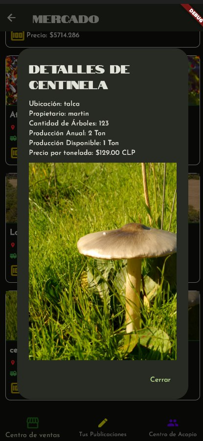
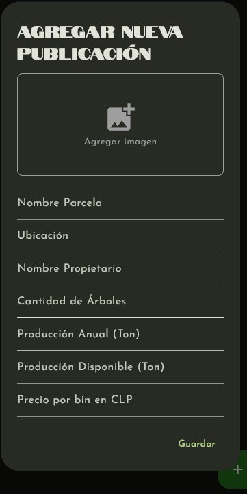
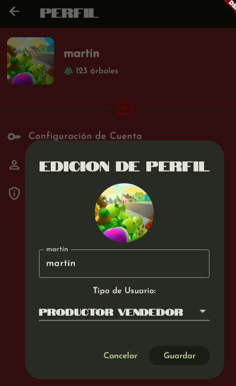
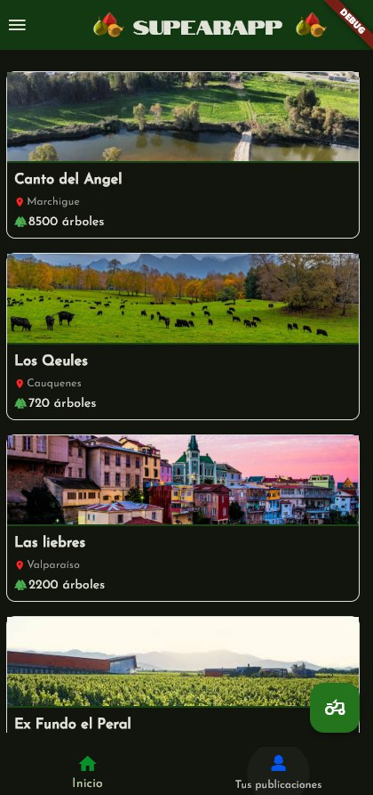

# SupearApp 
## Maqueta funcional 
### integrante: Martin Vera 
### Profesor: Manuel Moscoso

SupearApp es una aplicacion que permitira a los productores de peras tanto pequeños como grandes el poder calcular una media de produccion dependiendo de la extencion y de la cantidad de arboles.
El funcionamiento De la app es el siguiente:
partes en la pantalla de splash donde se vera el logo de la aplicacion para luego dar paso a la pantalla de Plantaciones, ahi hay un menu lateral en el cual se podra acceder a cada una de las pestañas disponibles como:
 * Perfil
 * Mercado
 * Plantaciones
 * Acerca de Nosotros -> encuesta.

 En plantaciones se encuentran las parcelas de los usuarios donde se podran ver la cantidad de arboles, la extencion, la ubicacion y la produccion estimada.
 En mercado se podra encontrar publicaciones tuyas las cuales podras crear siempre que seas comprador productor o productor,tambien veras publicaciones de otros usuarios donde se daran las opciones de formar centros de acopio que serian como grupos puestos por ubicacion para poder facilitar la venta y compra de productos.
 Dentro del apartado de Perfil encontrara una foto de usuario, la misma que en la barra laterar, sus cantidades de arboles y un boton para salir, tambien en la lista de abajo hallara opciones de ajustes, privacidad.

 nombre del paquete: cl.thesupreme.supearapp

 # Capturas de pantalla:
 
enlace del video: https://youtu.be/KTQwvnfhseE?si=16dGiQ3yWNksDQVx
enlace miro: https://miro.com/welcomeonboard/QzZ3aHNFeFRWRWRUT0x2cWNaSUdQZlgrN0VpRWJEMjVlaTRLYVg3YTUrdVpwaEFMVnhodWhRZkJoSSs0UjF6ajB5WW14V0taMlBvbkNOeTFmSnFyYlRERGpyREhFV2Y1d3RON1NOVVI4RlB1NFNuLzhjZXpjcUNSejlWWDNuWndnbHpza3F6REdEcmNpNEFOMmJXWXBBPT0hdjE=?share_link_id=139312983818

